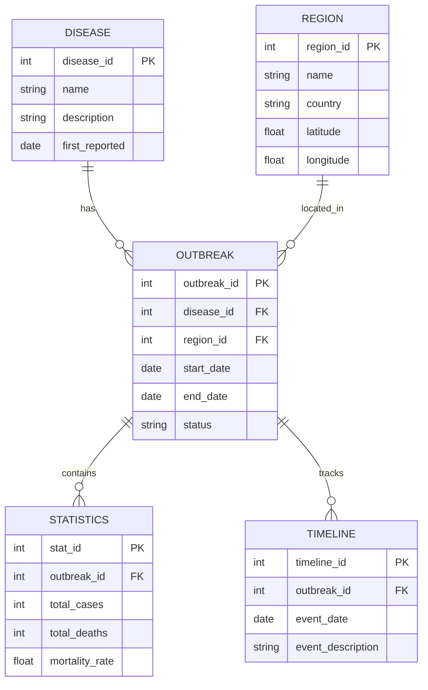

# Global Disease Tracker - Project Report

## 1. Title & Team Members
**Project Title:** Global Disease Tracker  
**Team Members:**
- [Your Name] (Project Lead)
- [Team Member 2]
- [Team Member 3]

## 2. Abstract
The Global Disease Tracker is a comprehensive web application designed to monitor, analyze, and visualize global disease outbreaks. The system provides real-time tracking of major pandemics including COVID-19, HIV/AIDS, and Smallpox, offering detailed insights into their spread, impact, and historical data. The application features interactive dashboards, comparison tools, and data exploration capabilities, making it an essential tool for researchers, healthcare professionals, and the general public.

## 3. Problem Statement

### Data Requirements:
- Historical and current disease outbreak data
- Geographic distribution information
- Mortality and infection rates
- Time-series data for trend analysis
- Demographic impact data

### Functional Requirements:
1. Interactive Dashboard
   - Real-time disease statistics
   - Geographic visualization
   - Trend analysis
   - Alert system for new outbreaks

2. Comparison Tool
   - Cross-disease comparison
   - Regional analysis
   - Temporal comparison
   - Impact assessment

3. Data Explorer
   - Advanced filtering
   - Custom visualization
   - Data export capabilities
   - Detailed analytics

## 4. ER Diagram & Relational Tables

### ER Diagram


### Sample Data
```sql
-- DISEASE Table
INSERT INTO DISEASE VALUES (1, 'COVID-19', 'Novel coronavirus', '2019-12-01');
INSERT INTO DISEASE VALUES (2, 'HIV/AIDS', 'Human Immunodeficiency Virus', '1981-06-05');
INSERT INTO DISEASE VALUES (3, 'Smallpox', 'Variola virus', '1977-10-26');

-- REGION Table
INSERT INTO REGION VALUES (1, 'North America', 'USA', 37.0902, -95.7129);
INSERT INTO REGION VALUES (2, 'Europe', 'Multiple', 54.5260, 15.2551);
INSERT INTO REGION VALUES (3, 'Asia', 'Multiple', 34.0479, 100.6197);

-- OUTBREAK Table
INSERT INTO OUTBREAK VALUES (1, 1, 1, '2020-01-20', NULL, 'Active');
INSERT INTO OUTBREAK VALUES (2, 2, 2, '1981-06-05', NULL, 'Active');
INSERT INTO OUTBREAK VALUES (3, 3, 3, '1977-10-26', '1980-05-08', 'Eradicated');

-- STATISTICS Table
INSERT INTO STATISTICS VALUES (1, 1, 700000000, 7000000, 1.0);
INSERT INTO STATISTICS VALUES (2, 2, 40000000, 25000000, 62.5);
INSERT INTO STATISTICS VALUES (3, 3, 300000000, 300000000, 100.0);

-- TIMELINE Table
INSERT INTO TIMELINE VALUES (1, 1, '2019-12-01', 'First cases reported in Wuhan, China');
INSERT INTO TIMELINE VALUES (2, 2, '1981-06-05', 'First cases of AIDS reported in the US');
INSERT INTO TIMELINE VALUES (3, 3, '1980-05-08', 'WHO declares smallpox eradicated');
```

## 5. DDL Commands

```sql
-- Create DISEASE Table
CREATE TABLE DISEASE (
    disease_id NUMBER PRIMARY KEY,
    name VARCHAR2(100) NOT NULL,
    description VARCHAR2(500),
    first_reported DATE
);

-- Create REGION Table
CREATE TABLE REGION (
    region_id NUMBER PRIMARY KEY,
    name VARCHAR2(100) NOT NULL,
    country VARCHAR2(100),
    latitude NUMBER(10,6),
    longitude NUMBER(10,6)
);

-- Create OUTBREAK Table
CREATE TABLE OUTBREAK (
    outbreak_id NUMBER PRIMARY KEY,
    disease_id NUMBER REFERENCES DISEASE(disease_id),
    region_id NUMBER REFERENCES REGION(region_id),
    start_date DATE NOT NULL,
    end_date DATE,
    status VARCHAR2(50),
    CONSTRAINT chk_status CHECK (status IN ('Active', 'Contained', 'Eradicated'))
);

-- Create STATISTICS Table
CREATE TABLE STATISTICS (
    stat_id NUMBER PRIMARY KEY,
    outbreak_id NUMBER REFERENCES OUTBREAK(outbreak_id),
    total_cases NUMBER,
    total_deaths NUMBER,
    mortality_rate NUMBER(5,2),
    CONSTRAINT chk_mortality CHECK (mortality_rate >= 0 AND mortality_rate <= 100)
);

-- Create TIMELINE Table
CREATE TABLE TIMELINE (
    timeline_id NUMBER PRIMARY KEY,
    outbreak_id NUMBER REFERENCES OUTBREAK(outbreak_id),
    event_date DATE NOT NULL,
    event_description VARCHAR2(500)
);

-- Create Indexes
CREATE INDEX idx_disease_name ON DISEASE(name);
CREATE INDEX idx_outbreak_dates ON OUTBREAK(start_date, end_date);
CREATE INDEX idx_region_location ON REGION(latitude, longitude);
```

## 6. SQL Queries

```sql
-- 1. Get all active outbreaks
SELECT d.name, r.name as region, o.start_date, s.total_cases, s.total_deaths
FROM DISEASE d
JOIN OUTBREAK o ON d.disease_id = o.disease_id
JOIN REGION r ON o.region_id = r.region_id
JOIN STATISTICS s ON o.outbreak_id = s.outbreak_id
WHERE o.status = 'Active';

-- 2. Get disease statistics by region
SELECT r.name as region, d.name as disease, 
       SUM(s.total_cases) as total_cases,
       SUM(s.total_deaths) as total_deaths,
       AVG(s.mortality_rate) as avg_mortality
FROM REGION r
JOIN OUTBREAK o ON r.region_id = o.region_id
JOIN DISEASE d ON o.disease_id = d.disease_id
JOIN STATISTICS s ON o.outbreak_id = s.outbreak_id
GROUP BY r.name, d.name;

-- 3. Get timeline of events for a specific disease
SELECT t.event_date, t.event_description
FROM TIMELINE t
JOIN OUTBREAK o ON t.outbreak_id = o.outbreak_id
JOIN DISEASE d ON o.disease_id = d.disease_id
WHERE d.name = 'COVID-19'
ORDER BY t.event_date;

-- 4. Get regions with highest mortality rates
SELECT r.name as region, d.name as disease,
       s.mortality_rate
FROM REGION r
JOIN OUTBREAK o ON r.region_id = o.region_id
JOIN DISEASE d ON o.disease_id = d.disease_id
JOIN STATISTICS s ON o.outbreak_id = s.outbreak_id
ORDER BY s.mortality_rate DESC
FETCH FIRST 10 ROWS ONLY;
```

## 7. UI Design

### Home Page


### Pandemics Page


### Comparison Tool


### Data Explorer


## 8. PL/SQL Procedures

```sql
-- Procedure to update outbreak statistics
CREATE OR REPLACE PROCEDURE update_outbreak_stats(
    p_outbreak_id IN NUMBER,
    p_new_cases IN NUMBER,
    p_new_deaths IN NUMBER
) AS
BEGIN
    UPDATE STATISTICS
    SET total_cases = total_cases + p_new_cases,
        total_deaths = total_deaths + p_new_deaths,
        mortality_rate = (total_deaths + p_new_deaths) / (total_cases + p_new_cases) * 100
    WHERE outbreak_id = p_outbreak_id;
    
    COMMIT;
END;
/

-- Function to calculate disease impact
CREATE OR REPLACE FUNCTION calculate_disease_impact(
    p_disease_id IN NUMBER
) RETURN NUMBER AS
    v_total_impact NUMBER;
BEGIN
    SELECT SUM(total_cases * mortality_rate)
    INTO v_total_impact
    FROM OUTBREAK o
    JOIN STATISTICS s ON o.outbreak_id = s.outbreak_id
    WHERE o.disease_id = p_disease_id;
    
    RETURN v_total_impact;
END;
/

-- Trigger to update outbreak status
CREATE OR REPLACE TRIGGER update_outbreak_status
AFTER UPDATE OF total_cases ON STATISTICS
FOR EACH ROW
BEGIN
    IF :NEW.total_cases = 0 THEN
        UPDATE OUTBREAK
        SET status = 'Eradicated',
            end_date = SYSDATE
        WHERE outbreak_id = :NEW.outbreak_id;
    END IF;
END;
/
```

## 9. Java Code

```java
// Database Connection
public class DBConnection {
    private static final String URL = "jdbc:oracle:thin:@localhost:1521:xe";
    private static final String USER = "system";
    private static final String PASS = "password";
    
    public static Connection getConnection() throws SQLException {
        return DriverManager.getConnection(URL, USER, PASS);
    }
}

// Disease Data Access Object
public class DiseaseDAO {
    public List<Disease> getAllDiseases() throws SQLException {
        List<Disease> diseases = new ArrayList<>();
        String query = "SELECT * FROM DISEASE";
        
        try (Connection conn = DBConnection.getConnection();
             PreparedStatement stmt = conn.prepareStatement(query);
             ResultSet rs = stmt.executeQuery()) {
            
            while (rs.next()) {
                Disease disease = new Disease();
                disease.setId(rs.getInt("disease_id"));
                disease.setName(rs.getString("name"));
                disease.setDescription(rs.getString("description"));
                disease.setFirstReported(rs.getDate("first_reported"));
                diseases.add(disease);
            }
        }
        return diseases;
    }
}

// Outbreak Service
public class OutbreakService {
    public void updateOutbreakStats(int outbreakId, int newCases, int newDeaths) {
        try (Connection conn = DBConnection.getConnection();
             CallableStatement stmt = conn.prepareCall("{call update_outbreak_stats(?, ?, ?)}")) {
            
            stmt.setInt(1, outbreakId);
            stmt.setInt(2, newCases);
            stmt.setInt(3, newDeaths);
            stmt.execute();
        } catch (SQLException e) {
            e.printStackTrace();
        }
    }
}
```

## 10. References
1. World Health Organization (WHO) - Disease Outbreak Data
2. Centers for Disease Control and Prevention (CDC) - COVID-19 Statistics
3. UNAIDS - HIV/AIDS Global Statistics
4. Oracle Database Documentation
5. Bootstrap Documentation
6. Chart.js Documentation

## 11. Output Screenshots

### Database Schema


### Application Dashboard


### Data Visualization


### Report Generation
 